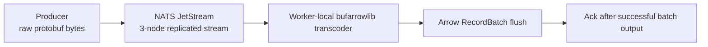

# I Finally Got a Clean Protobuf → Arrow Pipeline—Then the Bottleneck Moved

A friend of mine built something that forced me to rethink a chunk of ingestion code I had accepted as inevitable.

It’s called [bufarrowlib](https://github.com/loicalleyne/bufarrowlib). The idea is almost suspiciously clean: take raw Protobuf wire bytes, point the library at a descriptor, and emit Apache Arrow RecordBatches directly—no generated Go structs, no hand-written `RecordBuilder` glue, no second pass.

If you’ve built enough pipelines, that pitch lands right in the scar tissue.

Because the “normal” pipeline usually looks like this:

1. Receive bytes from Kafka or NATS
2. Decode into generated structs
3. Walk those structs again to populate Arrow builders
4. Rebuild that mapping every time the schema gets interesting

That is wasted motion: CPU, allocations, and code nobody wants to maintain.

`bufarrowlib` deletes that entire layer.

---

## Why I Built a Harness Around It

I work on systems where the ingestion path matters as much as the analytics path. If the first hop is expensive, everything downstream is compensating for it.

So when I saw a library that goes straight from wire bytes to Arrow memory, I didn’t want a toy benchmark. I wanted to know:

* Does this hold under real broker pressure?
* What does denormalization actually cost?
* When does HyperType meaningfully help?
* Where does the bottleneck move once decoding gets cheap?

That’s why I built [ArrowFlow](https://github.com/TFMV/arrowflow): not a microbenchmark, but a harness to push the entire path until the real constraints show up.

---

## The Pipeline

ArrowFlow wraps four moving pieces:

* A synthetic Protobuf event generator
* A NATS JetStream transport layer
* A `bufarrowlib` consumer (optionally using HyperType JIT parsing)
* An Arrow batch flush path (nested or denormalized)



That last step matters: in a real system, you acknowledge after the Arrow write succeeds—not when the message merely lands in memory.

---

## What’s Interesting About `bufarrowlib`

The key shift is *where complexity lives*.

Instead of procedural mapping code, you declare the shape you want.

```go
fd, _ := ba.CompileProtoToFileDescriptor(protoFile, []string{protoDir})
md, _ := ba.GetMessageDescriptorByName(fd, "Event")

ht := ba.NewHyperType(md, ba.WithAutoRecompile(0, 1.0))

opts := []ba.Option{
    ba.WithHyperType(ht),
    ba.WithDenormalizerPlan(
        pbpath.PlanPath("schema_version"),
        pbpath.PlanPath("event_timestamp"),
        pbpath.PlanPath("user.user_id"),
        pbpath.PlanPath("session.session_id"),
        pbpath.PlanPath("tracing.trace_id"),
        pbpath.PlanPath("payload.event_type"),
        pbpath.PlanPath("metrics[*].name"),
        pbpath.PlanPath("tags[*].key"),
    ),
}

_, _ = ba.New(md, memory.DefaultAllocator, opts...)
```

The `pbpath` layer is the real idea. It’s a declarative field-selection language:

* Dot notation for scalars
* `[*]` for repeated fields

You’re not describing traversal—you’re describing the Arrow schema you want. The library handles flattening, fanout, null-filling, and cross-joins.

What used to be hundreds of lines of nested loops becomes a list of paths.

---

## The Benchmarks That Actually Matter

I started with the library’s own benchmarks, but swapped in a realistic corpus: 506 BidRequest messages, 75% with two impressions, all fields populated.

Single-threaded (i7-13700H):

* Hand-written Arrow getters — 180k msg/s, 5,544 ns/msg, 131 allocs/msg
* AppendDenorm (proto.Message) — 73k msg/s, 13,662 ns/msg, 230 allocs/msg
* AppendRaw (HyperType) — 151k msg/s, 6,606 ns/msg, 98 allocs/msg
* AppendDenormRaw (HyperType) — **296k msg/s**, 3,376 ns/msg, 57 allocs/msg
* AppendDenormRaw (no HyperType) — 47k msg/s, 21,094 ns/msg, 275 allocs/msg

The important number:

**AppendDenormRaw with HyperType beats hand-written Arrow getters by 39%, with 57% fewer allocations.**

That’s not just faster—it’s structurally cheaper. Lower allocation pressure compounds under sustained load.

---

## Concurrency and Scaling

AppendRaw scaling (GOMAXPROCS=20):

* 1 worker → 79k msg/s
* 4 workers → 227k msg/s
* 8 workers → 296k msg/s
* 16 workers → 406k msg/s
* 80 workers → 463k msg/s

AppendDenormRaw peaks at ~481k msg/s around 16 workers, then flattens.

The library isn’t the bottleneck at that point.

---

## Batch Size Is Not a Detail

* batch=1 → 6.7k msg/s, 2,446 allocs/msg
* batch=100 → 102k msg/s, 47 allocs/msg
* batch=1,000 → 121k msg/s, 26 allocs/msg
* batch=122,880 → 129k msg/s, 24 allocs/msg

Two practical rules:

* Use batch ≥ 100
* If writing Parquet, align to 122,880 (DuckDB row group size)

---

## Clone vs New

This one matters more than it should.

* New: ~497µs
* Clone: ~272µs

Always create one Transcoder, then clone per worker:

```go
transcoders := []*ba.Transcoder{base}
for i := 1; i < workers; i++ {
    clone, _ := base.Clone(memory.NewGoAllocator())
    transcoders = append(transcoders, clone)
}
```

Creating transcoders in the hot loop is self-inflicted damage.

---

## The Concurrency Rule You Can’t Ignore

* `HyperType` is safe to share
* `Transcoder` is not

Correct pattern:

* One shared HyperType
* One Transcoder per worker (via Clone)

That’s the difference between a real system and a misleading benchmark.

---

## Python Bindings

`pybufarrow` exposes the same pipeline through the Arrow C Data Interface—zero-copy between Go and Python.

```python
from pybufarrow import HyperType, Transcoder

ht = HyperType("events.proto", "UserEvent")

with Transcoder.from_proto_file("events.proto", "UserEvent", hyper_type=ht) as tc:
    for raw in kafka_consumer:
        tc.append(raw)
    batch = tc.flush()
    df = batch.to_pandas()
```

Same model, same lifecycle, no serialization boundary.

---

## Making the Benchmark Honest

The biggest fix was simple: stop generating payloads during the timed run.

ArrowFlow prebuilds a corpus of raw wire messages and replays it. The benchmark measures:

* Transport
* Parsing
* Arrow append
* Batch flush

—not random data generation competing for CPU.

---

## Streaming Setup

3-node JetStream cluster, file-backed, replicas=3—all on one machine.

Not truly distributed, but enough to expose coordination cost.

---

## What the Streaming Numbers Say

Direct replay (nested, 8 workers):

* **182,999 msg/s**
* **476 MB/s**

Denormalized:

* 113,801 msg/s
* 296 MB/s

Conclusion: the library isn’t the bottleneck.

HyperType improves latency significantly (~1.5x), but throughput gains flatten in streaming mode. Once coordination dominates, making the consumer faster mostly reduces latency—not total throughput.

Batch size tradeoff (50k msg/s offered load):

* Larger batches → more memory, worse latency
* Sweet spot ~100

Denormalization:

* Slightly lower throughput
* Slightly *lower latency*

Once coordination dominates, “faster locally” and “faster end-to-end” diverge.

---

## Where the System Breaks

Saturation peaked around:

* ~5.8k msg/s observed
* 43µs consume latency
* 1.36ms produce latency

When direct replay clears 100k+ msg/s and the cluster tops out at ~6k, the conclusion is unavoidable:

**the bottleneck moved.**

---

## The Shift

At some point, this stops being about parsing.

The system transitions from:

* CPU-bound → coordination-bound
* decoding → admission control
* local efficiency → distributed backpressure

The chaos run made it visible:

* Rising buffer depth
* Growing consumer lag
* Stable broker, stressed edges

The pressure shows up first in batching and buffering—not immediate collapse.

---

## Why This Library Matters

`bufarrowlib` isn’t just faster—it removes an entire class of code:

* No generated struct churn
* No manual field mapping
* No intermediate object graphs
* Fewer copies before Arrow

And it does it while beating hand-written implementations on realistic data.

That’s the real claim.

The intermediate Go struct was never fundamental. It was just the least bad option we had.

---

## The Part That Sticks

The real takeaway isn’t “this library is fast.”

It’s this:

* Direct Protobuf → Arrow is a real systems win
* HyperType compounds under concurrency
* Denormalization can still clear 100k+ msg/s
* Batch size and cloning decisions are first-order effects
* And when you fix ingestion…

**the bottleneck moves exactly where it should**

From parsing to coordination.
From CPU to replication.
From code to queues.

That’s the result worth trusting.

---

