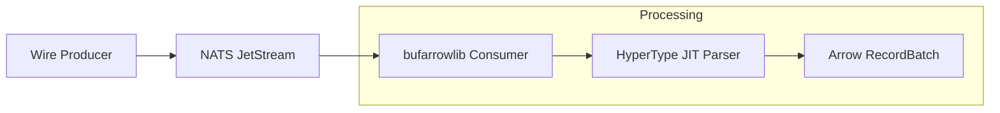

# I Tried to Break bufarrowlib. It Broke My Mental Model Instead.

A couple days ago, a friend of mine shipped something that solved a problem I'd been complaining about for years. It's called **[bufarrowlib](https://github.com/loicalleyne/bufarrowlib)** — a Go library that converts raw Protobuf wire bytes directly into Apache Arrow RecordBatches, no intermediate structs, no codegen.

I wanted to actually stress-test it. So I built **[ArrowFlow](https://github.com/TFMV/arrowflow)**, a scientific evaluation harness designed to find the breaking points of this pipeline on my Mac M4. What I found wasn't just faster numbers. It exposed where these pipelines fundamentally break — and why the bottleneck is almost never where you think it is.

---

## The Problem I Was Already Tired Of

If you've built high-throughput ingestion pipelines, you know the "Protobuf Tax." Receive raw bytes from Kafka or NATS, deserialize them into a Go struct, then manually map every field into an Arrow RecordBuilder. Then your schema changes. Then you're back in `protoc` hell, updating generated structs and hand-written mapping logic that nobody wants to touch.

It's slow. It's memory-hungry from all the intermediate allocations. And it's the kind of code that accumulates technical debt until someone has to rewrite it from scratch six months later.

My friend's core insight with `bufarrowlib` is almost aggressive in its simplicity: **raw bytes in, RecordBatches out.** You hand it a Protobuf descriptor and a declarative plan. It walks the wire bytes directly and writes into Arrow memory, skipping the intermediate Go struct entirely. No `protoc`. No generated code. Just bytes to columnar output.

I wanted to see if that held up under pressure.

---

## Building ArrowFlow

[ArrowFlow](https://github.com/TFMV/arrowflow) is a purpose-built scientific evaluation harness — not a toy benchmark, but something designed to find phase transitions and stability boundaries.



The harness runs six evaluation phases, each targeting a specific question:

* Where does HyperType's JIT overhead actually pay off?
* What batch size minimizes GC pressure without hurting latency?
* How much does denormalization cost versus nested processing?
* Where does throughput saturate, and why?
* Does adding workers actually help?
* What happens under chaos conditions — burst traffic, schema evolution, partition skew?

All results land in a `results.csv` for analysis. You can run the whole suite after spinning up a NATS JetStream container:

```bash
git clone https://github.com/TFMV/arrowflow.git
cd arrowflow
go mod tidy

# Start NATS (single-node or 3-node cluster — more on that shortly)
docker-compose up -d

# Run everything
./scripts/run-all-experiments.sh
```

---

## Phase 1: Single-Node Results

I started with a single local NATS instance on the M4. This is the baseline most people would use in development, and the results here are where `bufarrowlib` gets to show what it can actually do without coordination overhead in the way.

### HyperType Is Not Just For Large Messages

`bufarrowlib` ships a JIT parser called HyperType. It profiles real traffic in the background, identifies the most common field paths, and recompiles its internal parser on the fly. Workers pick it up on the next `Append` call — no restarts, no dropped messages.

I assumed the JIT overhead would be a wash on small payloads. I was wrong.

Mean consumption latency across message size profiles, baseline vs. HyperType:

**Small** — 12,897 ns → 2,913 ns — **4.4x improvement**

**Medium** — 17,484 ns → 3,642 ns — **4.8x improvement**

**Large** — 45,635 ns → 10,691 ns — **4.2x improvement**

**Heavy-tail** — 31,628 ns → 5,015 ns — **6.3x improvement**

That 4.4x on small payloads is the number that stuck with me. On the M4, compiled field access is efficient enough that the JIT context overhead becomes negligible almost immediately. If you're thinking you'll only enable HyperType for large messages, the data says don't bother making that call — just turn it on.

### Denormalization Is Faster Than I Expected

`bufarrowlib` supports a declarative denormalization plan. You specify field paths like `imp[*].bidfloor`, and it handles the cross-joins and null-filling automatically. What would have been 300 lines of nested loop logic becomes a 15-line YAML config.

I assumed the fan-out work would cost something meaningful in latency. Instead:

* **Nested processing:** 19,362 ns mean consume latency
* **Denormalized (flat rows):** 5,376 ns mean consume latency — **72% lower**

The reason appears to be that `bufarrowlib`'s internal denormalization plan is substantially more optimized than a generic recursive traversal of nested Protobuf structures. My friend built something smarter than the naive approach, and the numbers show it.

One caveat: if your denormalization paths create excessive cross-joins, memory growth can become non-linear. Watch your fan-out complexity.

### The Batch Size Sweet Spot

I swept batch sizes from 100 to 10,000 rows. GC counts stayed stable (~1,100–1,200 cycles) across the range, with a slight downward trend at 10,000 rows as allocation amortizes. Consumption latency was similarly stable (~5.4–6.7 μs), with a small uptick at the high end.

The sweet spot in my environment was **1,000 rows** — stable GC behavior, stable latency, no meaningful trade-offs. Your mileage will vary, but that's a reasonable default to start from.

### The Throughput Ceiling

This is where things got humbling. Rate sweeps from 10,000 to 200,000 messages per second all converged on the same ceiling: **roughly 1,850–1,950 msg/s**. Scaling workers from 2 to 16 didn't move the number.

The culprit isn't `bufarrowlib` — it's the single-threaded NATS consumer fetch mechanism. My pipeline was only as fast as its slowest broker fetch, and no amount of downstream parallelism could fix that. It's a good reminder that when you benchmark a library, you have to be honest about where the bottleneck actually lives.

That observation sent me somewhere more interesting.

---

## Phase 2: What Happens When You Add a Cluster?

After hitting the single-node ceiling, I switched to a **3-node NATS cluster running on the same M4 via Docker**. The goal wasn't to add hardware capacity — I was simulating distributed behavior on a single machine to isolate coordination costs from physical network effects.

This distinction matters. Every difference you see below is purely the cost of distributed topology.

### Throughput Collapses Under Coordination

Across workloads, the 3-node cluster consistently reduced throughput by 20–35%:

* Small messages: ~4,400 → ~3,100 msg/s
* Medium messages: ~3,200 → ~2,100 msg/s
* Heavy-tail: ~1,800 → ~1,500 msg/s

Once JetStream introduces RAFT replication and route coordination, the system stops being CPU-bound and becomes coordination-bound. That's not a bug — it's just the cost of durability and consensus.

### Latency Tails Widen

Mean latency sometimes looked stable between single-node and cluster runs, but p99 consistently degraded in cluster mode. RAFT smooths averages while introducing jitter under sustained load. If you're only watching mean latency, you'll miss this entirely.

### HyperType Loses Its Edge

In single-node runs, HyperType delivered consistent 4x–6x gains. In cluster mode, those gains eroded:

* Small workloads: still beneficial
* Medium workloads: reduced benefit
* Large workloads: marginal impact

The reason is simple. CPU-level optimization is no longer the bottleneck. When network coordination dominates execution time, a faster parser isn't the constraint you need to solve.

### One Surprising Upside: Batch Efficiency Improved

In several structured workloads, batch formation latency actually improved in cluster mode, likely due to better upstream buffering alignment. This gain was ultimately overwhelmed by downstream coordination overhead — but it's a useful signal. Better upstream backpressure could potentially recover some of it.

---

## The Boundary That Actually Matters

This is what ArrowFlow revealed that a standard benchmark wouldn't:

**Single-node execution is a compute problem. Cluster execution is a coordination problem. They require completely different optimization strategies.**

In single-node mode, the wins come from inside the pipeline — JIT parsing, flat denormalization, smarter batching. `bufarrowlib` excels here because it eliminates an entire processing layer.

In cluster mode, those internal wins become secondary. The throughput ceiling shifts upstream, to broker topology, replication factor, flush cadence, and how well your batch formation aligns with broker acknowledgment cycles. The library can't fix that. Your architecture has to.

Neither of these is a critique of `bufarrowlib`. It's a reminder that measuring a library in isolation only tells you part of the story. ArrowFlow was built to find the part you usually miss.

---

## A Few Things That Will Bite You

Writing this harness taught me some sharp edges worth knowing before you reach for `bufarrowlib` in production:

**Thread isolation is non-negotiable.** `Transcoder` and `HyperType` instances are not thread-safe. Sharing one across goroutines will cause segfaults or silent state corruption. Use `.Clone()` to create per-worker instances.

**Always release your RecordBatches.** `defer rec.Release()` is mandatory. Arrow memory lives on the C++ heap, outside Go's GC. Skip the release and you will leak it.

**Benchmark in nanoseconds, not milliseconds.** The hot path on `bufarrowlib` runs in the 2–15 microsecond range. Millisecond resolution makes everything look flat. This took me an embarrassing amount of time to fully internalize when designing the harness.

**HyperType has a warmup period.** The first few hundred messages process through the slower dynamic parser while the JIT profile builds. Don't draw conclusions from a cold start.

**Broker configuration dominates observed performance.** In misconfigured NATS, `Produce` latencies can spike to ~500ms due to unbuffered direct fallback logic. A properly configured JetStream instance with memory storage brings that back down where it belongs. Get your broker right before you start tuning anything else.

---

## Final Thoughts

I expected incremental improvement. What I found was a change in architecture.

`bufarrowlib` doesn't just make the Protobuf-to-Arrow pipeline faster. It removes a layer we assumed was structurally necessary. The intermediate Go struct isn't a detail — it's a design assumption baked into every hand-written ingestion pipeline I've seen. My friend's library questions that assumption and wins.

ArrowFlow helped me understand where that win applies and where the constraints shift. Single-node: optimize the library. Distributed: optimize the topology. Knowing which problem you're actually solving changes everything about how you approach it.

If you're still writing manual `RecordBuilder` code, take a look at `bufarrowlib`. And if you want to actually understand your pipeline under pressure — not just measure it — run ArrowFlow against it.

All scripts, configs, and results are in the repo. Run it. Push it. Break it.
