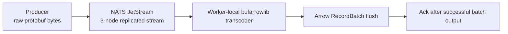
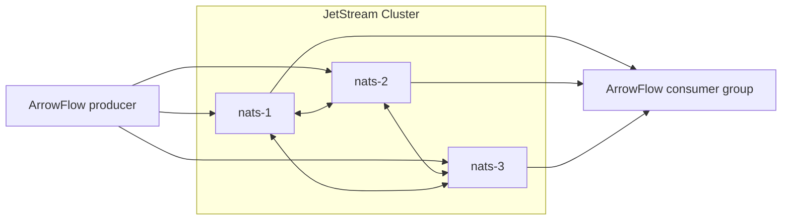

# My Friend Built The Protobuf -> Arrow Library I Wish I’d Had Years Ago

A friend of mine built a library that immediately made me rethink a bunch of ingestion code I had accepted as inevitable.

It is called `bufarrowlib`, and the idea is almost suspiciously clean:

take raw Protobuf wire bytes, point the library at a descriptor, and write Apache Arrow batches directly without the usual detour through generated Go structs and hand-written `RecordBuilder` glue.

If you have built enough pipelines, that pitch hits right in the scar tissue.

Because the normal pipeline usually looks like this:

1. receive bytes from Kafka or NATS
2. decode into generated structs
3. walk those structs again
4. copy everything into Arrow builders
5. repeat until somebody changes the schema
6. go update codegen, mapping logic, tests, and all the sharp edges around them

That is a lot of CPU, a lot of allocation, and a lot of code nobody actually wants to own.

`bufarrowlib` goes after that entire layer.

## Why I Built A Whole Harness Around It

The reason I got excited is that I work on systems where the ingestion path matters as much as the analytics path. If the first hop is expensive, every downstream optimization is fighting uphill.

So when my friend showed me a library that could go from raw wire bytes to Arrow memory directly, I did not want a toy benchmark. I wanted to know:

- does this hold up under real broker pressure?
- what does denormalization actually cost?
- when does HyperType help enough to matter?
- where does the bottleneck move once decoding gets cheaper?

That is why I built ArrowFlow: not as a microbenchmark, but as a way to push the whole path until the real bottlenecks showed up.

## The Pipeline I Wanted To Measure

ArrowFlow is a Go harness around four moving pieces:

- a synthetic Protobuf event generator
- a NATS JetStream transport layer
- a `bufarrowlib` consumer with optional HyperType JIT parsing
- an Arrow batch flush path with denormalized and nested modes

At a high level, the system looks like this:



That last step matters more than it looks. In a real streaming system, the right place to ack is after the Arrow write path succeeds, not when the message merely lands in an in-process queue.

## What I Like About `bufarrowlib`

The library is interesting to me because it changes where complexity lives.

Instead of writing procedural mapping code, you declare the shape you want.

A simplified setup from ArrowFlow looks like this:

```go
fd, err := ba.CompileProtoToFileDescriptor(protoFile, []string{protoDir})
if err != nil {
	return nil, err
}

md, err := ba.GetMessageDescriptorByName(fd, "Event")
if err != nil {
	return nil, err
}

opts := []ba.Option{
	ba.WithHyperType(ba.NewHyperType(md, ba.WithAutoRecompile(100_000, 0.01))),
	ba.WithDenormalizerPlan(
		pbpath.PlanPath("schema_version"),
		pbpath.PlanPath("event_timestamp"),
		pbpath.PlanPath("user.user_id"),
		pbpath.PlanPath("session.session_id"),
		pbpath.PlanPath("tracing.trace_id"),
		pbpath.PlanPath("payload.event_type"),
		pbpath.PlanPath("metrics[*].name"),
		pbpath.PlanPath("tags[*].key"),
	),
}

tc, err := ba.New(md, memory.DefaultAllocator, opts...)
```

That denorm plan is the whole point. The interesting thing is not just that the library understands Protobuf. It is that it lets you describe the Arrow shape you want without writing the usual pile of structural traversal code by hand.

The repeated fields are explicit:

- `metrics[*].name`
- `tags[*].key`

That means the fanout is not hypothetical. The transcoder is really flattening repeated structures into Arrow rows.

## The Concurrency Rule You Really Cannot Ignore

One thing my friend was very clear about, and the harness confirmed quickly: transcoders are worker-local resources.

Do not share them across goroutines.

The ArrowFlow worker model is deliberately boring:

```go
transcoders := []*ba.Transcoder{base}
for i := 1; i < workers; i++ {
	clone, err := base.Clone(memory.NewGoAllocator())
	if err != nil {
		return err
	}
	transcoders = append(transcoders, clone)
}
```

That looks like a small detail, but it is the difference between a serious pipeline and a benchmark that lies to you.

Each worker gets:

- its own transcoder clone
- its own append path
- its own batch flush cadence

That keeps the library in the space it was designed for, and it keeps the benchmark from smuggling shared-state problems into the results.

## The Systems Detail That Matters Most

Once I had a reliable broker path in place, the core ingestion loop became this:

```go
for item := range wc.inputChan {
	raw := item.msg.Payload

	if err := tc.AppendDenormRaw(raw); err != nil {
		_ = item.msg.Term()
		continue
	}

	pending = append(pending, item.msg)
	if len(pending) >= wc.batchSize {
		flushBatch(tc, pending)
		pending = pending[:0]
	}
}
```

And the important part of `flushBatch` is not the batch creation itself. It is the settlement rule:

```go
rec := tc.NewDenormalizerRecordBatch()
defer rec.Release()

for _, msg := range pending {
	if err := msg.Ack(); err != nil {
		log.Printf("batch ack failed: %v", err)
	}
}
```

This is one of those systems details that sounds boring until it is wrong.

When it is wrong, you get benchmarks that look fast and pipelines that lose data.

## The Broker Setup I Used

For the latest run I used a 3-node JetStream cluster, file-backed, with `Replicas=3`.

That matters because I was not interested in measuring a local happy-path publish loop. I wanted to know what happens once coordination is part of the hot path.

The topology is simple:



All three nodes were on one machine, so this is still single-host cluster behavior, not a true multi-host distributed benchmark. But it is enough to expose the coordination cost, which is what I cared about most for this round.

## What The Numbers Actually Say

I reran the full STREAM suite after fixing the harness and landed on a result set that feels honest.

The data lives in `results/all-experiments/results.csv`, but the most interesting parts are easy to summarize.

### HyperType is not a rounding error

On the replicated STREAM path, mean consume latency dropped by:

- `2.95x` on small messages: `26.9 us` -> `9.1 us`
- `1.95x` on medium messages: `37.2 us` -> `19.0 us`
- `1.52x` on large messages: `119.5 us` -> `78.7 us`
- `2.02x` on heavy-tail messages: `75.8 us` -> `37.5 us`

That is strong enough that I would enable it by default unless I had a very specific reason not to.

### The best batch size was still about `1000`

At `50000 msg/s` offered load with heavy-tail payloads:

- `batch=100` reached `2253.99 msg/s`, `41.5 us` mean consume latency, `38.45 MB` heap
- `batch=500` reached `2142.19 msg/s`, `40.2 us`, `241.77 MB` heap
- `batch=1000` reached `2402.62 msg/s`, `36.5 us`, `223.98 MB` heap
- `batch=5000` reached `2068.75 msg/s`, `48.7 us`, `1343.04 MB` heap
- `batch=10000` reached `2199.06 msg/s`, `53.5 us`, `1477.80 MB` heap

This is exactly the trade you would expect in a real pipeline: after a point, “bigger batch” mostly means “more queued memory.”

### Denormalization was the real surprise

For this schema, denormalized output beat nested output.

At `50000 msg/s` offered load:

- nested mode: `1998.80 msg/s`, `52.8 us` mean consume latency
- denorm mode: `2932.68 msg/s`, `32.3 us` mean consume latency

And this was not fake fanout. The heavy-tail denorm path averaged:

- `72.37x` denorm fanout
- `8` Arrow columns in the selected plan
- `66,323` average rows per emitted batch in the denorm run

That result is specific to this event shape and this denorm plan, but it is still impressive. My friend’s library is doing real structural work here, not just flattening a few scalars.

### The broker path became the long pole

The saturation sweep peaked at:

- `5404.24 msg/s` observed throughput at `200000 msg/s` offered load
- `32.5 us` mean consume latency
- `1.45 ms` mean produce latency

That last number is the tell.

Once the parser and Arrow append path get cheap enough, the bottleneck moves out toward:

- replicated broker admission
- producer-side backpressure
- batch cadence
- queue depth

That is exactly the shift I wanted the harness to expose. Once the local decode path gets good enough, the bottleneck stops hiding.

## Where The System Actually Starts To Bend

One thing I like about this run is that the failure surfaces are visible.

At high saturation and in chaos mode, the system did not primarily collapse into broker lag. It tended to accumulate in-process buffer depth first.

The chaos run looked like this:

- `28892` consumed messages in `20s`
- `655.4 us` mean produce latency
- `38.7 us` mean consume latency
- `365.48 MB` heap allocation
- `7817` peak buffer depth
- `0` sustained consumer lag

That tells me the first pressure surface in this environment is consumer-side buffering and batch formation, not the broker falling irrecoverably behind.

## The Worker Story Was Less Exciting Than People Usually Hope

I also swept worker counts, because everybody always asks whether more goroutines fix the problem.

At `50000 msg/s` offered load:

- `2 workers`: `2120.17 msg/s`, `36.2 us` mean consume latency
- `4 workers`: `2057.39 msg/s`, `39.6 us`
- `8 workers`: `1759.39 msg/s`, `52.7 us`
- `16 workers`: `2133.66 msg/s`, `51.5 us`

So no, this was not a case where “just add workers” solved it.

That is another sign that the system is not compute-bound in the naive sense. Coordination and memory behavior are already in charge.

## Why I Think `bufarrowlib` Matters

What my friend built is not just a faster parser.

It is a library that removes an entire category of ingestion code:

- less generated-struct churn
- less handwritten field mapping
- less object materialization
- fewer copies before Arrow

That is the architectural win.

The performance win is real, but the bigger idea is that the intermediate Go struct was never a law of nature. It was just the thing most of us tolerated because the alternatives were worse.

`bufarrowlib` is the first Go library I have used in this space that made that assumption feel unnecessary.

## The Part I Keep Coming Back To

The story I wanted to tell after building ArrowFlow is not “my friend made a magic library.”

It is more interesting than that.

The story is:

- yes, direct Protobuf -> Arrow is a real systems win
- yes, HyperType materially improves the hot path
- yes, real denormalization can still be fast
- and once those pieces get efficient enough, the bottleneck moves exactly where a distributed systems engineer would expect it to move

from parsing to coordination

from local CPU to replicated admission

from clever decode logic to queueing, batching, and backpressure

That is the result I trust most.

And as someone who has spent too much time maintaining the old shape of these pipelines, I am genuinely happy my friend built the thing that made me question it.
