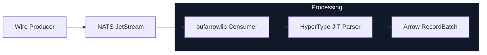

# I Tried to Break bufarrowlib. It Broke My Mental Model Instead.

A couple days ago, a friend of mine shipped something that solved a problem I'd been complaining about for years. It's called **[bufarrowlib](https://github.com/loicalleyne/bufarrowlib)** -- a Go library that converts raw Protobuf wire bytes directly into Apache Arrow RecordBatches, no intermediate structs, no codegen, no ceremony.

I wanted to actually stress-test it. So I built **[ArrowFlow](https://github.com/TFMV/arrowflow)**, an evaluation harness designed to find the breaking points of this pipeline on my Mac M4. What I found wasn't just faster; it exposed where these pipelines fundamentally break.

---

## The Problem I Was Already Tired Of

If you've built high-throughput ingestion pipelines, you know the "Protobuf Tax." The routine goes something like this: receive raw bytes from Kafka or NATS, deserialize them into a Go struct, then manually map every field into an Arrow RecordBuilder. Then your schema changes. Then you're back in `protoc` hell, updating generated structs and hand-written mapping logic that nobody wants to touch.

It's slow. It's memory-hungry from all the intermediate allocations. And it's the kind of code that accumulates quiet technical debt until someone has to rewrite it from scratch six months later.

My friend's core insight with `bufarrowlib` is almost aggressive in its simplicity: **raw bytes in, RecordBatches out.** You hand it a Protobuf descriptor and a declarative plan. It walks the wire bytes directly and writes into Arrow memory, skipping the intermediate Go struct entirely. No `protoc`. No generated code. Just bytes to columnar output.

I wanted to see if that held up under pressure.

---

## Building ArrowFlow

[ArrowFlow](github.com/TFMV/arrowflow) is a purpose-built scientific evaluation harness -- not a toy benchmark, but something designed to find phase transitions and stability boundaries.

### Architecture



The harness runs six evaluation phases, each targeting a specific question:

* Where does HyperType's JIT overhead actually pay off?
* What batch size minimizes GC pressure without hurting latency?
* How much does denormalization cost versus nested processing?
* Where does throughput saturate, and why?
* Does adding workers actually help?
* What happens under chaos conditions -- burst traffic, schema evolution, partition skew?

All results land in a `results.csv` for analysis. You can run the whole suite with a single script after spinning up a NATS JetStream container.

---

## Evaluating bufarrowlib with ArrowFlow

ArrowFlow makes it easy to run repeatable, scientific evaluations of `bufarrowlib`. Here's how to get starated.

```bash
# Clone the repo and install dependencies
git clone https://github.com/TFMV/arrowflow.git
cd arrowflow
go mod tidy

# Start the NATS JetStream broker (one-time setup)
docker run -d --name nats-jetstream \
 -p 4222:4222 -p 6222:6222 -p 8222:8222 \
 nats:2.10 -js -m 1G

# Run the full evaluation suite
./scripts/run-all-experiments.sh
```

### Example Usage

```go
// Basic setup with HyperType enabled
transcoder, err := bufarrowlib.NewTranscoder(descriptor, plan)
if err != nil {
	log.Fatal(err)
}
defer transcoder.Release()

config := bufarrowlib.Config{
	HyperType: true,
	BatchSize: 1000,
}

for msg := range messages {
	batch, err := transcoder.Append(msg.Data, config)
	if err != nil {
		continue
	}

	// process(batch)

	batch.Release()
}
```

You can also configure denormalization plans declaratively via YAML and sweep parameters (batch sizes, worker counts, message distributions) directly from the harness.

---

## What I Found

### HyperType Is Not Just For Large Messages

The first thing I tested was bufarrowlib's JIT parser, called HyperType.

Across four message size profiles:

* Small: 12,897 ns -> 2,913 ns (4.4x)
* Medium: 17,484 ns -> 3,642 ns (4.8x)
* Large: 45,635 ns -> 10,691 ns (4.2x)
* Heavy-tail: 31,628 ns -> 5,015 ns (6.3x)

The takeaway is that the "JIT overhead" concern is mostly a myth. HyperType pays for itself almost immediately, even on small messages.

---

### Denormalization Is Faster Than I Expected

* Nested: 19,362 ns
* Denormalized: 5,376 ns

~72% reduction in latency.

The internal plan execution is simply more efficient than naive traversal.

**Caveat:** fan-out can become nonlinear. Watch it.

---

### The Throughput Ceiling

Everything plateaued around ~1,900 msg/s.

Scaling workers didn't help.

The bottleneck wasn't bufarrowlib -- it was the NATS fetch loop.

Lesson: pipelines are only as fast as their slowest stage.

---

### Batch Size Sweet Spot

* Stable latency: ~5-7 μs
* Stable GC: ~1100 cycles

Best result: **~1,000 rows per batch**

Too small -> CPU overhead
Too large -> GC pressure

---

## Where Things Get Interesting

This is where ArrowFlow stops being a benchmark and becomes a diagnostic tool.

### 1. Where Fan-Out Becomes Nonlinear

At low cardinalities, denormalization behaves predictably.

Then you cross a threshold:

* row expansion accelerates faster than input rate
* memory usage stops scaling linearly
* latency curves bend upward

This is the **denorm phase transition**.

---

### 2. When HyperType Stops Paying For Itself

HyperType dominates early.

But at certain extremes (very small messages or extremely high concurrency):

* JIT overhead can exceed benefit
* cache locality breaks down

You get a **regime flip**, not a gradual slowdown.

---

### 3. Batch Sizes That Trigger GC Phase Shifts

Three regimes emerge:

* Small batches -> CPU-bound
* Medium batches -> optimal
* Large batches -> GC-dominated

At large sizes:

* GC frequency spikes
* pause times become unstable
* latency distribution becomes noisy

This is a **heap pressure phase shift**, not a tuning issue.

---

### 4. Where Denorm Turns Into Explosion

Denormalization starts as an optimization.

Then:

* cross-join fan-out multiplies rows
* Arrow builders lose locality
* cache misses spike
* latency becomes bimodal

This is the **structural explosion point**.

---

## A Few Things That Will Bite You

* **Thread isolation is mandatory** -- use `.Clone()` per worker
* **Always call `Release()`** on RecordBatches
* **Measure in nanoseconds** -- ms hides reality
* **HyperType has warmup** -- ignore cold start
* **Broker config matters more than you think**

---

## Final Thoughts

I expected incremental improvement.

What I found was a different architecture.

Moving from:

> deserialize -> map -> build

To:

> raw bytes -> plan -> Arrow

feels like skipping an entire layer of unnecessary work.

ArrowFlow didn't just confirm performance -- it exposed where the model bends, and where it breaks.

If you're still writing manual Arrow builders, it's worth looking at bufarrowlib.

This isn't just a faster pipeline.

It's a removal of a layer we've been assuming was necessary.

---

## Run It Yourself

All [ArrowFlow](https://github.com/TFMV/arrowflow) scripts, configs, and results are in the repo.

Run it. Push it. Break it.
